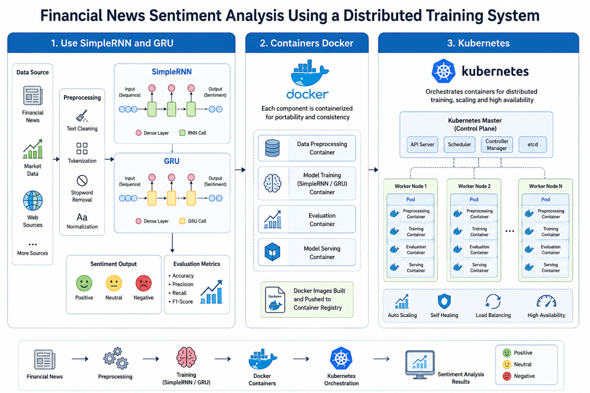

# 💹 Financial News Sentiment Analysis Using a Distributed Training System

---

## Project Overview

This capstone project develops and evaluates deep learning models for **Financial News Sentiment Analysis** using both **single-worker** and **distributed multi-worker** TensorFlow training with Kubernetes.

### Main project diagram



According to the diagram above, we divide our project to three parts:

**1. Use SimpleRNN and GRU**

This stage prepares the financial news data by cleaning the text, removing stopwords, tokenizing, and normalizing it before training the models. The processed data is then used to train and compare the SimpleRNN and GRU models to classify news as positive, neutral, or negative, and their performance is evaluated using accuracy, precision, recall, and F1-score.

**2. Containers (Docker)**

After selecting the best-performing models, each part of the system is packaged into separate Docker containers, including data preprocessing, model training, evaluation, and serving. Docker ensures that the application runs consistently across different environments and simplifies deployment.

**3. Kubernetes**

Kubernetes manages the Docker containers by distributing them across multiple worker nodes and coordinating them through a master node. It provides automatic scaling, load balancing, self-healing, and high availability, enabling efficient distributed training and reliable execution of the sentiment analysis system.

### Main Features


- **GloVe word embeddings** Uses pre-trained GloVe embeddings to convert words into meaningful numerical vectors for deep learning.
  
- **Bidirectional SimpleRNN and BiGRU** Applies bidirectional recurrent neural networks to capture contextual information from both past and future words in a sentence.

- **Attention Data and  augmentation** Generates additional training samples through text augmentation techniques to improve model generalization and reduce the impact of class imbalance. Enables the model to focus on the most important words when making sentiment predictions.
  
- **Hyperparameter tuning** Optimizes model parameters, such as learning rate, dropout, and hidden units, to improve classification performance.
  
- **Docker containerization** Packages the application and its dependencies into Docker containers for consistent and portable execution.

- **Kubernetes deployment (Minikube)** Deploys and manages Docker containers on a local Kubernetes cluster using Minikube for distributed execution.

- **MultiWorkerMirroredStrategy** Uses TensorFlow's distributed training strategy to synchronize model training across multiple worker nodes.

---

## 📊 Datasets

- **Hugging Face Twitter Financial News Sentiment Dataset**
  The Twitter Financial News Sentiment dataset contains financial news headlines collected from Twitter and is labeled into three sentiment classes: positive, neutral, and negative. The dataset consists of approximately 11,932 samples, with neutral sentiment representing the majority class, followed by positive and negative classes. The dataset is relatively imbalanced, making it suitable for evaluating sentiment classification models under real-world financial news conditions.
   
- **Kaggle Sentiment Analysis for Financial News Dataset**
The Kaggle Financial News dataset contains 4,846 financial news sentences annotated with sentiment labels (positive, neutral, and negative). The class distribution is approximately 2,878 neutral (59.4%), 1,363 positive (28.1%), and 605 negative (12.5%) samples, indicating a noticeable class imbalance toward neutral sentiment. This dataset is widely used as a benchmark for financial sentiment analysis because it contains expert-labeled financial text and reflects the sentiment characteristics commonly found in financial news articles.  
---

## Workflow pipeline for our models

In the first part of the project. We have to build the pipeline and we need to test with two data sets (Twitter Finacial Dataset and Kaggle financial Dataset)

```text
Financial News
      │
      ▼
Text Cleaning
      │
      ▼
Text Augmentation
      │
      ▼
Tokenization
      │
      ▼
GloVe Embedding
      │
      ▼
BiSimpleRNN / BiGRU
      │
      ▼
Attention Layer
      │
      ▼
Dense Layer
      │
      ▼
Softmax
      │
      ▼
Sentiment Prediction
```
---

# 🧠 Our deeplearning Models 

| Model | Description |
|-------|-------------|
| SimpleRNN | Baseline |
| BiSimpleRNN | Bidirectional RNN |
| GRU | Baseline GRU |
| BiGRU | Best overall model |

---

# 📈 Final Results for the model pipeline

| Dataset | Best Model | Accuracy |
|---------|------------|---------:|
| Twitter | BiGRU | **81.62%** |
| Kaggle | BiGRU | **77.99%** |

---

## 🐳 Docker

**Docker implementation** Packages the financial sentiment analysis system into portable containers, including data preprocessing, model training, evaluation, and distributed training components, ensuring consistent execution across different environments.

#### Diagram Explanation

The Docker host contains three connected workers: Worker 0 (Chief), Worker 1, and Worker 2. The chief worker coordinates training, saves the final model, and performs evaluation, while Workers 1 and 2 help process the training workload and communicate their gradient updates with the chief.


All three workers use the same model configuration and participate in synchronous training. In your implementation, each worker also loads a copy of the training dataset, and the workers exchange updates after every training step to keep the model weights identical.

**Benefits of Containers and APIs**

- Consistent execution Containers package the model, code, and dependencies together, allowing the project to run consistently across different workers and environments.
- Easy communication and access – An API allows other applications or users to send financial text to the model and receive sentiment predictions without directly accessing the training code.
- Scalability and deployment – Containers can be replicated and managed through Docker or Kubernetes, while the API provides a simple connection to the deployed sentiment analysis service.
- We can usually increase the number of workers without changing the model’s Python code, as long as the workers are already configured to use MultiWorkerMirroredStrategy

**Final Result for Docker**

The Docker implementation successfully created a distributed training environment with three containers: one chief worker and two additional workers. TensorFlow’s MultiWorkerMirroredStrategy synchronized model training across the containers, but the speed improvement was limited because all three workers shared the same physical machine and hardware resources.

**Recommendation**

For future improvement, the Docker workers should run on separate physical machines or cloud nodes and use a larger dataset or more complex model. Dataset sharding, optimized batch sizes, learning-rate scaling, and multi-GPU resources are also recommended to reduce duplicated work and make distributed training more efficient.

---

### ☸ Kubernetes

**Kubernetes implementation**: Deploys and manages the Docker containers across multiple worker pods, automating distributed training, worker scheduling, restart recovery, and scaling while coordinating TensorFlow MultiWorkerMirroredStrategy.

### Benefits of using Kubernetes

- **Automatic scaling** Kubernetes can easily increase or decrease the number of worker pods to support distributed model training without modifying the application code.
- **Fault tolerance** If a worker pod fails during training, Kubernetes automatically restarts or replaces it, improving the reliability of the distributed system.
- **Centralized orchestration** Kubernetes manages the deployment, scheduling, communication, and lifecycle of the chief and worker pods, simplifying the execution of distributed TensorFlow training.

**Final Result for Kubernetes**

The Kubernetes implementation successfully orchestrated the distributed training environment by managing one chief pod and two worker pods running TensorFlow MultiWorkerMirroredStrategy. Although Kubernetes correctly handled pod deployment, scheduling, and synchronized training, the performance improvement was limited because all pods ran on the same physical machine and shared the same CPU, memory, and storage resources.

**Recommendation**

For future work, the Kubernetes cluster should be deployed across multiple physical machines or cloud nodes to provide additional computing resources and reduce resource contention. Using larger datasets, dataset partitioning (data sharding), optimized batch sizes, learning-rate scaling, and multi-GPU or cloud-based Kubernetes clusters would better demonstrate the scalability and performance benefits of distributed training.


---
### Comparison Between Single-Worker and Three-Worker Training

This project compared single-worker and three-worker training using Bidirectional SimpleRNN (BiSimpleRNN) and Bidirectional GRU (BiGRU) on the Twitter and Kaggle financial sentiment datasets. The three-worker implementation successfully demonstrated distributed training using TensorFlow MultiWorkerMirroredStrategy with one chief worker and two worker nodes.

Overall, single-worker training achieved better classification accuracy and Macro-F1 scores than three-worker training. Although the Twitter BiGRU reduced training time from 149 seconds to 105 seconds, the remaining experiments showed little or no speed improvement, and model accuracy decreased The results suggest that distributed training becomes more beneficial when using larger datasets, more complex models, and multiple physical machines or cloud-based Kubernetes clusters. Future improvements such as dataset partitioning, optimized batch sizes, learning-rate scaling, and multi-node deployment are expected to improve both training efficiency and scalability.in all distributed runs. This occurred because all three Docker containers shared the same physical hardware and synchronized model parameters after every training step, introducing communication overhead.

Among the two models, BiGRU consistently outperformed BiSimpleRNN in both training environments because its gating mechanism captures long-term contextual information more effectively. However, the experiments showed that distributed training provides limited benefits for relatively small datasets and lightweight models.


---

### 📂 Repository Structure

SimpleRNNGRU/

├──<a href="analysis">analysis/</a>

├──<a href="docker">docker/</a>

├──<a href="kubernetes">kubernetes/</a>

├──<a href="simplernngru">Simplernngru/</a>

---

# 👤 Author

**Alaa Yagoub**

Toronto Metropolitan University

