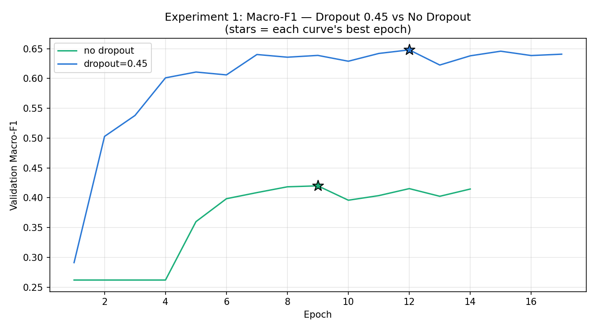
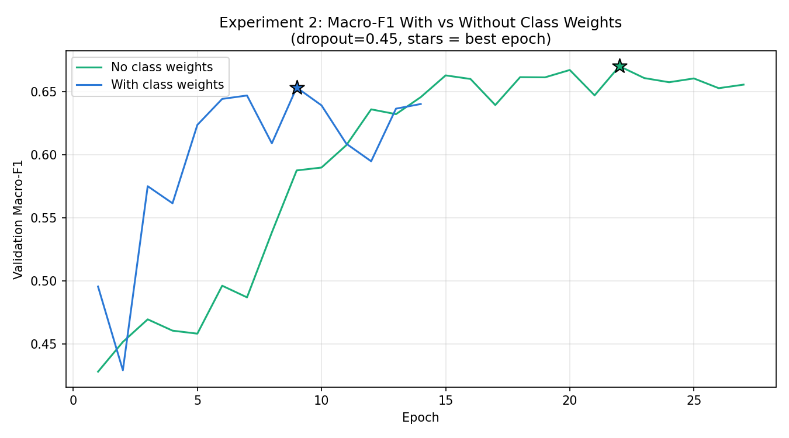
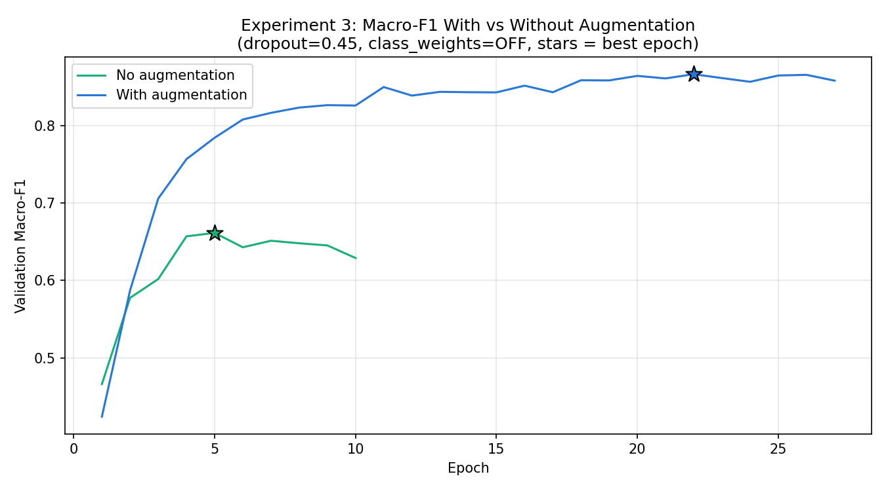
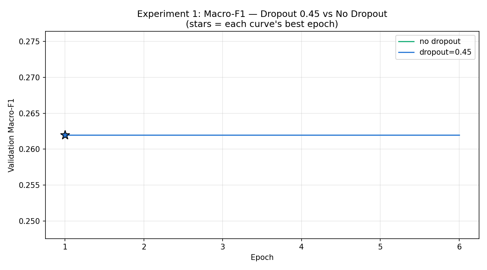
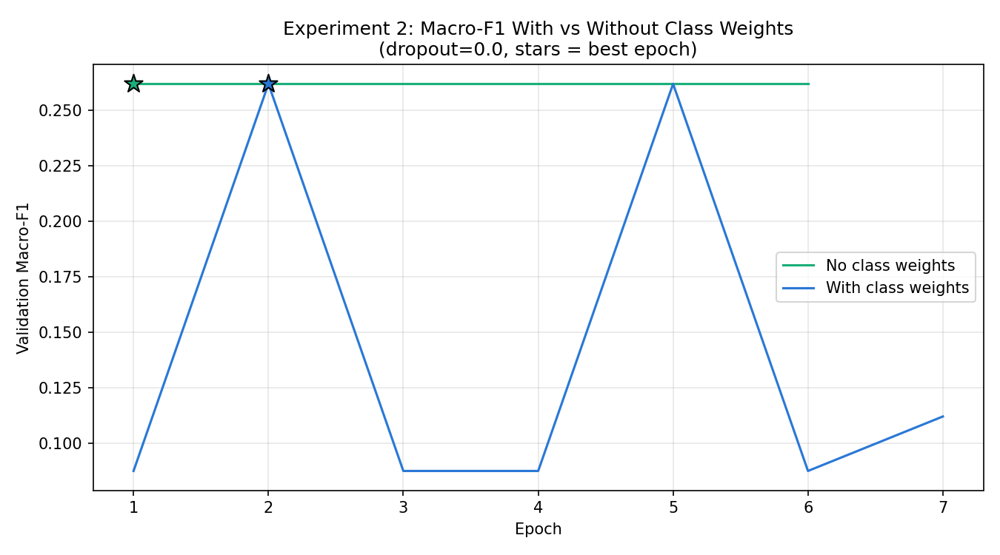
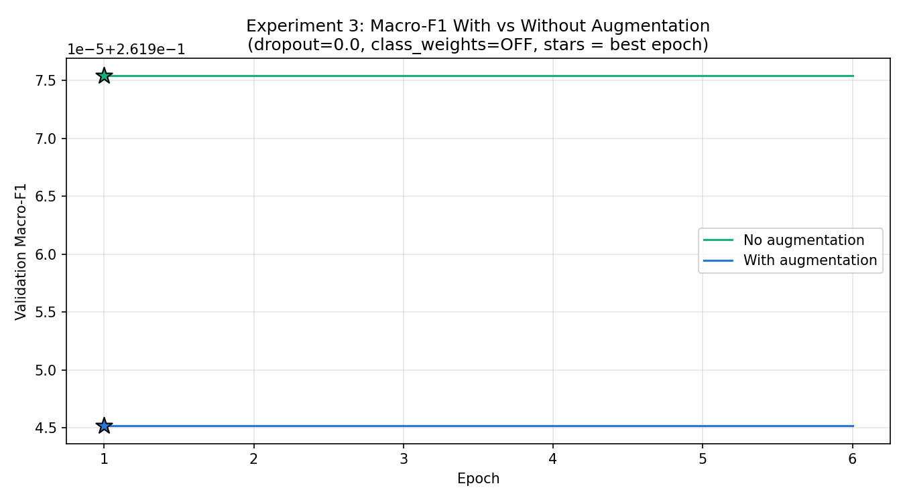
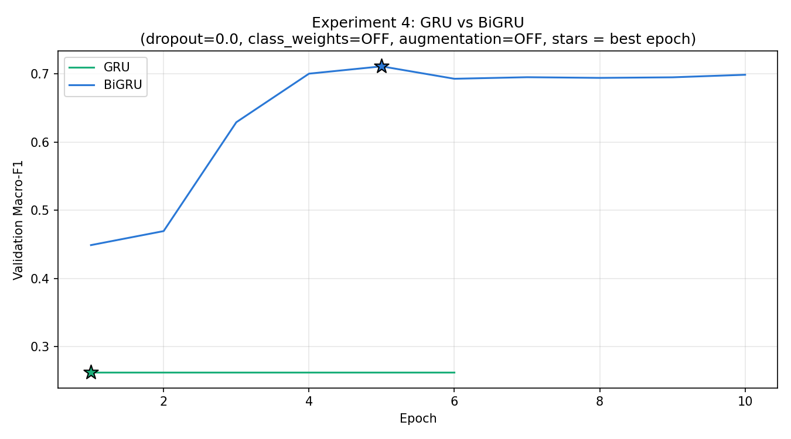

# Analysis for Data (Twitter financial New)

## Calculate the methods to choose the best Hyperparameters

Best Learning Rate [0.0005, 0.001, 0.002]:

Best Vocab Size [6000, 10000, 15000]

Best Embedding Dimension [32, 64, 128]

Best Vocab Size [6000, 10000, 15000]

We calculated for each class

Precision=TP /(FP+TP)

Recall=TP/(FN+TP)​

F1= (Precision + Recall)/2

Macro-F1=(F1 bearish​ + F1 bullish​ + F1 neutral​​)/3

How to use:

Loop by value depending Macro-F1 (the best value)

Calculate Macro-F1:

We calculated for each class

Precision=TP /(FP+TP)

Recall=TP/(FN+TP)​

F1= (Precision + Recall)/2

Macro-F1=(F1 bearish​ + F1 bullish​ + F1 neutral​​)/3

## Best Hyperparameters (Twitter financial New)

### Model: BiSimpleRNN

<b>Best BiSimpleRNN Hyperparameters Found</b>

Best Learning Rate [0.0005, 0.001, 0.002, 0.005]: 0.0005
Best Vocab Size [6000, 10000, 15000]: 6000
Best Embedding Dimension [32, 64, 128]: 32
Best RNN Units [32, 64, 128]: 32

Final combined BiSimpleRNN -> Accuracy: 77.43%  Macro-F1: 0.6820

<b>Dataset label distribution</b>

Train class counts -> Bearish: 1442 (15.1%) | Bullish: 1923 (20.2%) | Neutral: 6178 (64.7%)

Test class counts -> Bearish: 347 (14.5%) | Bullish: 475 (19.9%) | Neutral: 1566 (65.6%)

<a href="bisimplernn_hyperparameter_twitter.py">bisimplernn_hyperparameter_twitter.py</a>

<b>SimpleRNN (dropout, class weight, Augmentation, Bi-directional</b>

Dropout:

Class weight:

Augmentation (depending on NLP)

SimpleRNN vs BiSimpleRNN

<a href="four_experiments_simplernn_twitter.py">four_experiments_simplernn_twitter.py</a>

### Model: BiGRU

<b>MENTION — Best BiGRU Hyperparameters Found</b>

Best Learning Rate [0.0005, 0.001, 0.002, 0.005]: 0.005

Best Vocab Size [6000, 10000, 15000]: 6000

Best Embedding Dimension [32, 64, 128]: 128

Best RNN Units [32, 64, 128]: 128

Final combined BiGRU -> Accuracy: 81.95%  Macro-F1: 0.7387

Train class counts -> Bearish: 1442 (15.1%) | Bullish: 1923 (20.2%) | Neutral: 6178 (64.7%)

Test class counts -> Bearish: 347 (14.5%) | Bullish: 475 (19.9%) | Neutral: 1566 (65.6%)

<a href="bigru_hyperparameter_twitter.py">bigru_hyperparameter_twitter.py</a>

<b>GRU (dropout, class weight, Augmentation, Bi-directional)</b>

Best dropout setting (Exp 1): dropout=0.45

EXPERIMENT 4 SUMMARY

  GRU             best_macro_f1=0.2620  best_epoch=1
  
  BiGRU           best_macro_f1=0.7109  best_epoch=5

<b>FINAL OVERALL SUMMARY</b>

Best dropout setting (Exp 1):     no dropout

Best class-weight setting:        OFF

Best augmentation setting (Exp 3): OFF

GRU best macro-F1:     0.2620 (epoch 1)

BiGRU best macro-F1:   0.7109 (epoch 5)

Dropout:

Class weight:

Augmentation (depending on NLP)

SimpleRNN vs BiSimpleRNN

<a href="four_experiments_gru_twitter.py">four_experiments_gru_twitter.py</a>

# Analysis for Data (Kaggle)
