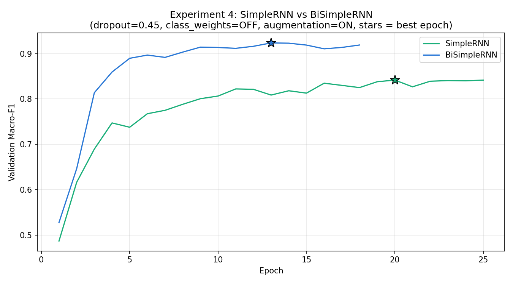
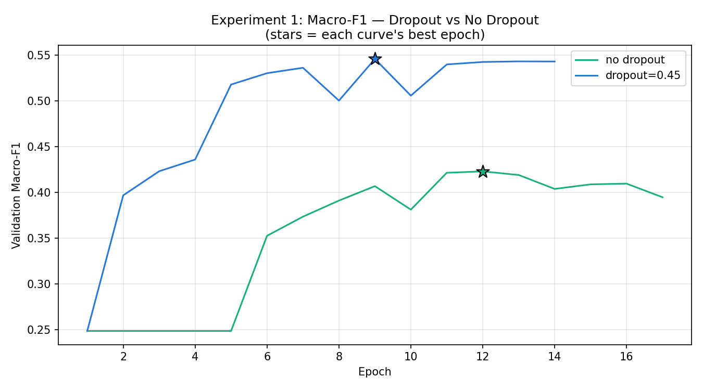
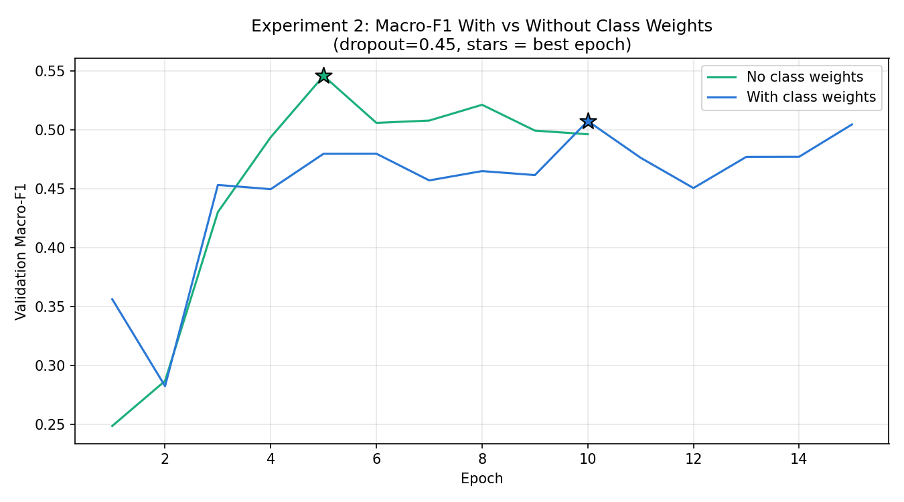
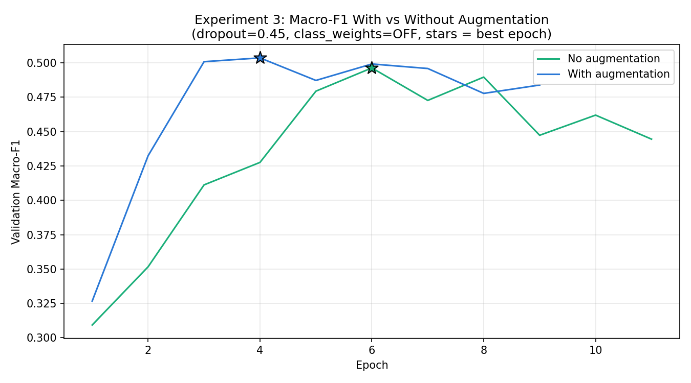
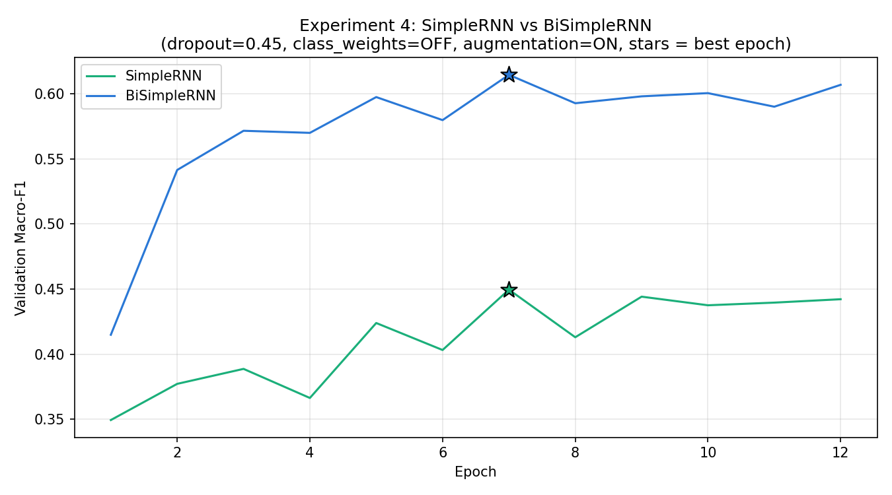
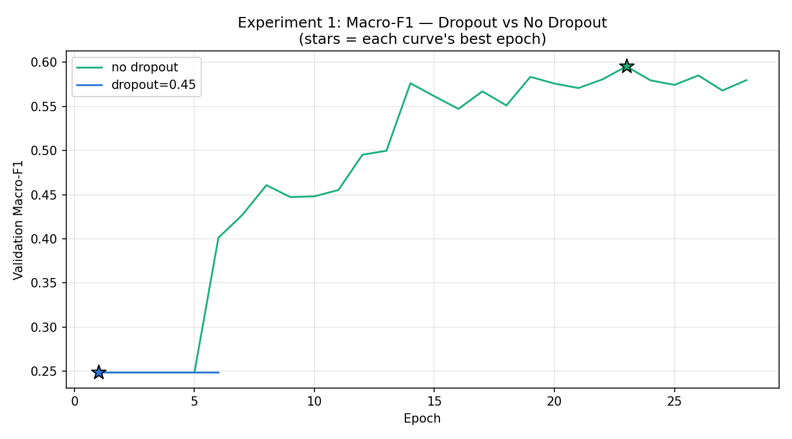
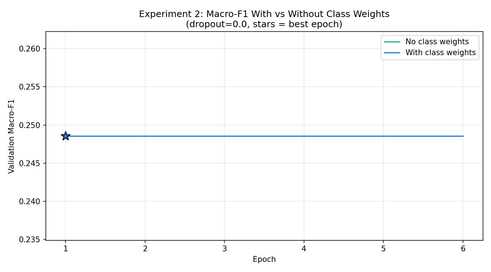
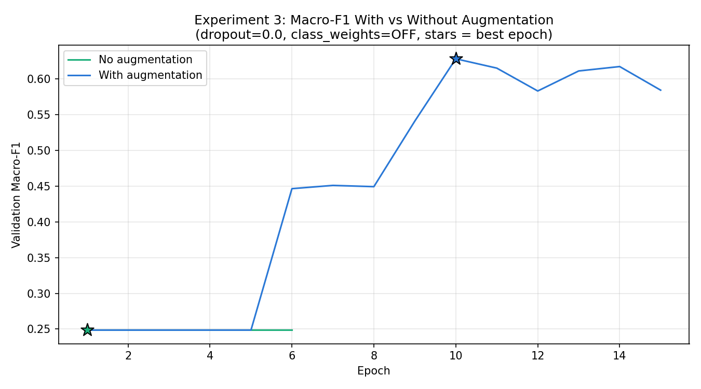
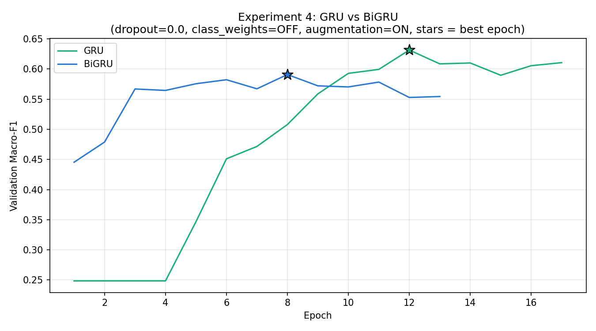

# Analysis for Data (Twitter financial New)

## Calculate the methods to choose the best Hyperparameters

Best Learning Rate [0.0005, 0.001, 0.002]:

Best Vocab Size [6000, 10000, 15000]

Best Embedding Dimension [32, 64, 128]

Best Vocab Size [6000, 10000, 15000]


We calculated for each class

Precision=TP /(FP+TP)

Recall=TP/(FN+TP)​

F1= (Precision + Recall)/2

Macro-F1=(F1 bearish​ + F1 bullish​ + F1 neutral​​)/3

How to use:

Loop by value depending Macro-F1 (the best value)

Calculate Macro-F1:

We calculated for each class

Precision=TP /(FP+TP)

Recall=TP/(FN+TP)​

F1= (Precision + Recall)/2

Macro-F1=(F1 bearish​ + F1 bullish​ + F1 neutral​​)/3

## Best Hyperparameters (Twitter financial New)

### Model: BiSimpleRNN

```
Best BiSimpleRNN Hyperparameters Found
Best Learning Rate [0.0005, 0.001, 0.002, 0.005]: 0.0005
Best Vocab Size [6000, 10000, 15000]: 6000
Best Embedding Dimension [32, 64, 128]: 32
Best RNN Units [32, 64, 128]: 32
Final combined BiSimpleRNN -> Accuracy: 77.43%  Macro-F1: 0.6820
Dataset label distribution

Train class counts -> Bearish: 1442 (15.1%) | Bullish: 1923 (20.2%) | Neutral: 6178 (64.7%)
Test class counts -> Bearish: 347 (14.5%) | Bullish: 475 (19.9%) | Neutral: 1566 (65.6%)
```

<a href="bisimplernn_hyperparameter_twitter.py">bisimplernn_hyperparameter_twitter.py</a>

```
EXPERIMENT 4 SUMMARY
  SimpleRNN       best_macro_f1=0.8417  best_epoch=20
  BiSimpleRNN     best_macro_f1=0.9237  best_epoch=13

FINAL OVERALL SUMMARY

Best dropout setting (Exp 1):     dropout=0.45
Best class-weight setting:        OFF
Best augmentation setting (Exp 3): ON
SimpleRNN best macro-F1:     0.8417 (epoch 20)
BiSimpleRNN best macro-F1:   0.9237 (epoch 13)
```
<b>SimpleRNN (dropout, class weight, Augmentation, Bi-directional</b>

Dropout:


Class weight:


Augmentation (depending on NLP)


SimpleRNN vs BiSimpleRNN



<a href="four_experiments_simplernn_twitter.py">four_experiments_simplernn_twitter.py</a>


### Model: BiGRU

<b>MENTION — Best BiGRU Hyperparameters Found</b>

Best Learning Rate [0.0005, 0.001, 0.002, 0.005]: 0.005

Best Vocab Size [6000, 10000, 15000]: 6000

Best Embedding Dimension [32, 64, 128]: 128

Best RNN Units [32, 64, 128]: 128

Final combined BiGRU -> Accuracy: 81.95%  Macro-F1: 0.7387

Train class counts -> Bearish: 1442 (15.1%) | Bullish: 1923 (20.2%) | Neutral: 6178 (64.7%)

Test class counts -> Bearish: 347 (14.5%) | Bullish: 475 (19.9%) | Neutral: 1566 (65.6%)

<a href="bigru_hyperparameter_twitter.py">bigru_hyperparameter_twitter.py</a>

<b>GRU (dropout, class weight, Augmentation, Bi-directional)</b>

Best dropout setting (Exp 1): dropout=0.45

```
EXPERIMENT 4 SUMMARY
  GRU             best_macro_f1=0.2620  best_epoch=1
  BiGRU           best_macro_f1=0.7109  best_epoch=5

FINAL OVERALL SUMMARY

Best dropout setting (Exp 1):     no dropout
Best class-weight setting:        OFF
Best augmentation setting (Exp 3): OFF
GRU best macro-F1:     0.2620 (epoch 1)
BiGRU best macro-F1:   0.7109 (epoch 5)
```

Dropout:


Class weight:


Augmentation (depending on NLP)


GRU vs BiGRU


<a href="four_experiments_gru_twitter.py">four_experiments_gru_twitter.py</a>

# Analysis for Data (Kaggle)

## Model: BiSimpleRNN

### Calculate the methods to choose the best Hyperparameters

```
MENTION — Best BiSimpleRNN Hyperparameters Found
Best Learning Rate [0.0005, 0.001, 0.002, 0.005]: 0.0005
Best Vocab Size [6000, 10000, 15000]: 6000
Best Embedding Dimension [32, 64, 128]: 64
Best RNN Units [32, 64, 128]: 32
Final combined BiSimpleRNN -> Accuracy: 68.23%  Macro-F1: 0.6335
Dataset label distribution
Train class counts -> Negative: 513 (12.5%) | Neutral: 2447 (59.4%) | Positive: 1159 (28.1%)
Test class counts -> Negative: 91 (12.5%) | Neutral: 432 (59.4%) | Positive: 204 (28.1%)
```

<a href="bisimplernn_hyperparameter_kaggle.py">bisimplernn_hyperparameter_kaggle.py</a>

```
FINAL OVERALL SUMMARY
SimpleRNN       best_macro_f1=0.5691  best_epoch=16
BiSimpleRNN     best_macro_f1=0.6353  best_epoch=6
Best dropout setting (Exp 1): dropout=0.45
Best class-weight setting:    OFF
Best augmentation setting:    ON
SimpleRNN best macro-F1:     0.5691 (epoch 16)
BiSimpleRNN best macro-F1:   0.6353 (epoch 6)
```

<b>SimpleRNN (dropout, class weight, Augmentation, Bi-directional</b>

Dropout:



Class weight:



Augmentation (depending on NLP)



SimpleRNN vs BiSimpleRNN



<a href="four_experiments_simplernn_kaggle.py">four_experiments_simplernn_kaggle.py</a>

## Model: GRU

### Calculate the methods to choose the best Hyperparameters

```MENTION — Best BiSimpleRNN Hyperparameters Found

Best Learning Rate [0.0005, 0.001, 0.002, 0.005]: 0.0005
Best Vocab Size [6000, 10000, 15000]: 6000
Best Embedding Dimension [32, 64, 128]: 64
Best RNN Units [32, 64, 128]: 32

Final combined BiSimpleRNN -> Accuracy: 68.23%  Macro-F1: 0.6335

Dataset label distribution
Train class counts -> Negative: 513 (12.5%) | Neutral: 2447 (59.4%) | Positive: 1159 (28.1%)
Test class counts -> Negative: 91 (12.5%) | Neutral: 432 (59.4%) | Positive: 204 (28.1%)
```
<a href="bisimplernn_hyperparameter_kaggle.py">bisimplernn_hyperparameter_kaggle.py</a>

```
EXPERIMENT 4 SUMMARY
  GRU             best_macro_f1=0.6314  best_epoch=12
  BiGRU           best_macro_f1=0.5907  best_epoch=8

=============================================
FINAL OVERALL SUMMARY
=============================================
Best dropout setting (Exp 1): no dropout
Best class-weight setting:    OFF
Best augmentation setting:    ON
GRU best macro-F1:     0.6314 (epoch 12)
BiGRU best macro-F1:   0.5907 (epoch 8)

```

<b>GRU (dropout, class weight, Augmentation, Bi-directional</b>

Dropout:



Class weight:



Augmentation (depending on NLP)



GRU vs BiGRU



<a href="four_experiments_gru_kaggle.py">four_experiments_gru_kaggle.py</a>


# Final result

## Twitter Financial news

### Model: BiSimpleRNN 

```
BiSimpleRNN     best_macro_f1=0.9237  best_epoch=13

FINAL OVERALL SUMMARY

Best dropout setting (Exp 1):     dropout=0.45
Best class-weight setting:        OFF
Best augmentation setting (Exp 3): ON
SimpleRNN best macro-F1:     0.8417 (epoch 20)
BiSimpleRNN best macro-F1:   0.9237 (epoch 13)

────────────────────────────────────────────────────
CLASSIFICATION REPORT  (BiSimpleRNN + WordNet augmentation)
────────────────────────────────────────────────────
              precision    recall  f1-score   support

     bearish       0.63      0.42      0.51       347
     bullish       0.62      0.66      0.64       475
     neutral       0.85      0.90      0.87      1566

    accuracy                           0.78      2388
   macro avg       0.70      0.66      0.67      2388
weighted avg       0.77      0.78      0.77      2388

Test accuracy   : 78.14%
Test macro-F1   : 0.6725
Best val epoch  : 2 (best val_macro_f1=0.6762)
Training time   : 32s
Parameters      : 404,739
```

<a src="bisimplernn_twitter_financial_final.py">bisimplernn_twitter_financial_final.py</a>

### Model: BiGRU

```
BiGRU           best_macro_f1=0.7109  best_epoch=5

FINAL OVERALL SUMMARY

Best dropout setting (Exp 1):     no dropout
Best class-weight setting:        OFF
Best augmentation setting (Exp 3): OFF
BiGRU best macro-F1:   0.7109 (epoch 5)

────────────────────────────────────────────────────
CLASSIFICATION REPORT  (BiGRU)
────────────────────────────────────────────────────
              precision    recall  f1-score   support

     bearish       0.67      0.49      0.57       347
     bullish       0.70      0.61      0.65       475
     neutral       0.84      0.92      0.88      1566

    accuracy                           0.80      2388
   macro avg       0.74      0.68      0.70      2388
weighted avg       0.79      0.80      0.79      2388

Test accuracy   : 79.77%
Test macro-F1   : 0.6998
Best val epoch  : 3 (best val_macro_f1=0.7000)
Training time   : 30s
Parameters      : 438,147
```

<a src="bigru_twitter_financial_final.py">bigru_twitter_financial_final.py</a>

## Kaggle stock news

### SimpleRNN

```
FINAL OVERALL SUMMARY
BiSimpleRNN     best_macro_f1=0.6353  best_epoch=6
Best dropout setting (Exp 1): dropout=0.45
Best class-weight setting:    OFF
Best augmentation setting:    ON
BiSimpleRNN best macro-F1:   0.6353 (epoch 6)

────────────────────────────────────────────────────
CLASSIFICATION REPORT  (BiSimpleRNN + WordNet augmentation)
────────────────────────────────────────────────────
              precision    recall  f1-score   support

    negative       0.54      0.36      0.43       121
     neutral       0.80      0.84      0.82       576
    positive       0.59      0.62      0.60       273

    accuracy                           0.72       970
   macro avg       0.64      0.60      0.62       970
weighted avg       0.71      0.72      0.71       970

Test macro-F1  : 0.6178
Best val epoch : 3 (best val_macro_f1=0.5894)
```

<a src="bisimplernn_kaggle_final.py">bisimplernn_kaggle_final.py</a>

### GRU

```
=============================================
FINAL OVERALL SUMMARY
=============================================
Best dropout setting (Exp 1): no dropout
Best class-weight setting:    OFF
Best augmentation setting:    ON
BiGRU best macro-F1:   0.5907 (epoch 8)

────────────────────────────────────────────────────
CLASSIFICATION REPORT  (BiGRU + WordNet augmentation)
────────────────────────────────────────────────────
              precision    recall  f1-score   support

    negative       0.62      0.61      0.62       121
     neutral       0.79      0.80      0.79       576
    positive       0.59      0.59      0.59       273

    accuracy                           0.71       970
   macro avg       0.67      0.67      0.67       970
weighted avg       0.71      0.71      0.71       970

Test macro-F1  : 0.6666
Best val epoch : 9 (best val_macro_f1=0.6296)


```

<a src="bigru_kaggle_final.py">bigru_kaggle_final.py</a>