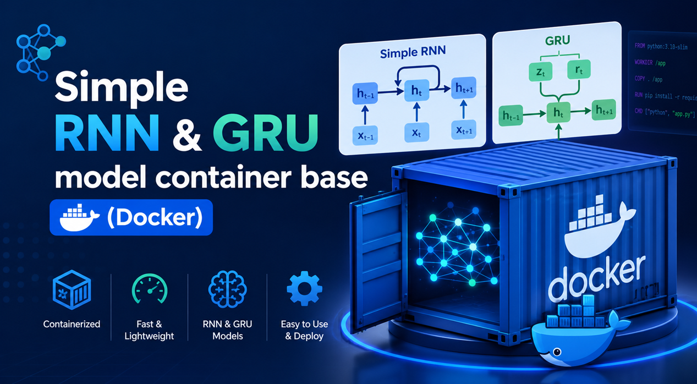
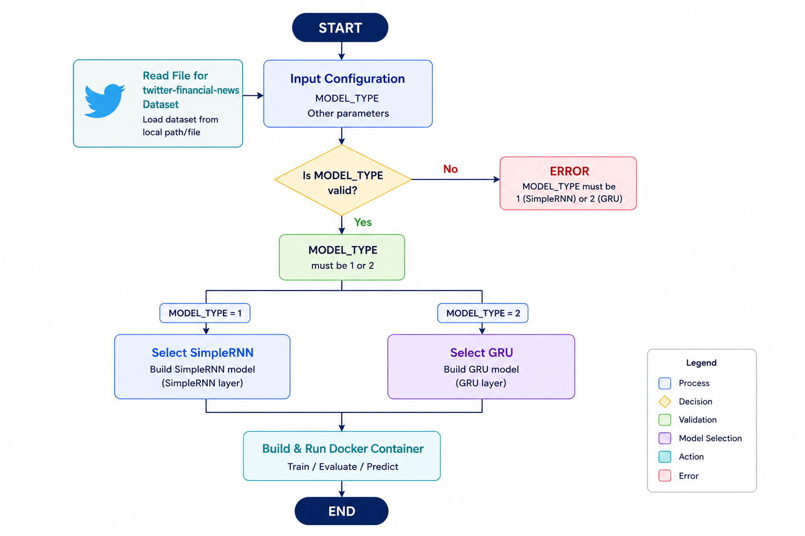
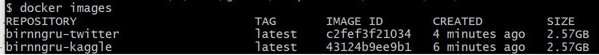
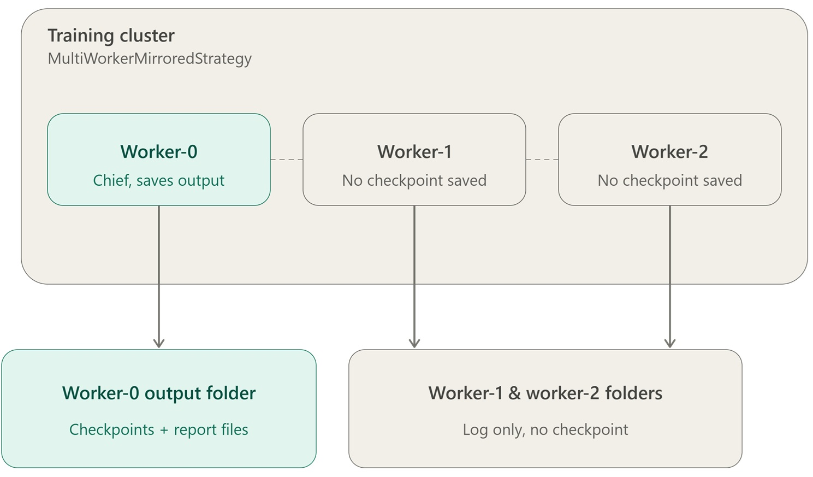
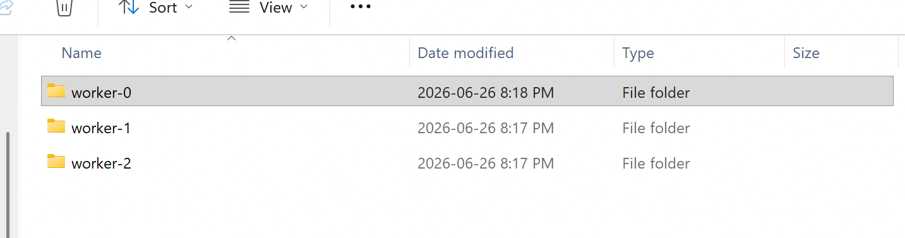

# Simple RNN & GRU model container base (Docker)

<center></center>


## I. Project plan:

After improve the models (SimpleRNN and GRU). We have to containarize the two models and use these two models with two dataset (Twitter & Kaggle).

(i) Prepare the Python code to merge the two models (SimpleRNN and GRU). We generate two python files for each dataset.

- Add model-type parameter to choose the model (SimpleRNN and GRU)

- Use the code for using Bi-directional and Class wight improvement

(ii) Data processing pipline: We prepare data, add wight for data processing.

(iii) Build the two files (each file with Data set) in container. We will have two containers

(iii) Build the image for each container

(IV) Run the three workers. Each one contains the image in iii. The first one is Chief and the other two are slaves.

(V) The train data will go to three output folders. But the main folder that we can use it is worker-0 (for the Chief worker)

(VI) After that we one simple model (SimpleRNN or GRU) to load the train model and predict.


## II. Prepare the file from phase-1 to phase-2
We need to merge the two files from phase one. Merge the SimpleRNN and GRU for each Dataset (Kaggle & Twitter Financial news)

<b>1-Twitter financial news for SimpleRNN and GRU</b>



<a href="birnn_bigru_twitter_multiworker.py">birnn_bigru_twitter_multiworker.py</a>

<b>2-Twitter financial news for SimpleRNN and GRU</b>


<a href="birnn_bigru_kaggle_multiworker.py">birnn_bigru_kaggle_multiworker.py</a>

## III. Prepare the file for building images

We need to build the image through building Dockerfile

<b>1- Dockerfile for Twitter financial news (SimpleRNN and GRU)</b> 

Dataset: Twitter (from Hugging face: zeroshot/twitter-financial-news-sentiment)

Each image has:

<b>MODEL_TYPE</b>

MODEL_TYPE = 1  ->  Bidirectional SimpleRNN

MODEL_TYPE = 2  ->  Bidirectional GRU

<b>Input</b>

Input paramter: bitsimplernn-worker-(1|2|3 ...).env

This is to keep the setting configuration for the cluster

<b>Output</b>

-Input volume point to input folder

-output volume point to output folder


```
FROM python:3.11-slim

WORKDIR /app

RUN apt-get update && apt-get install -y --no-install-recommends \
        build-essential \
        git \
        curl \
    && rm -rf /var/lib/apt/lists/*

COPY requirements.kaggle requirements.txt
RUN pip install --no-cache-dir --upgrade pip && \
    pip install --no-cache-dir -r requirements.txt

COPY birnn_bigru_kaggle_multiworker.py .

VOLUME ["/data/input", "/data/output"]
EXPOSE 12345

# --model-type, --input, --output, --start-delay are passed at `docker run` time
ENTRYPOINT ["python", "birnn_bigru_kaggle_multiworker.py"]
```

<a href="Dockerfile.twitter">Dockerfile.twitter</a>

<b>2- Dockerfile for Kaggle (SimpleRNN and GRU)</b> 

Dataset: Kaggle (file:all-data.csv)

Each image has:

<b>MODEL_TYPE</b>

MODEL_TYPE = 1  ->  Bidirectional SimpleRNN

MODEL_TYPE = 2  ->  Bidirectional GRU

<b>Input</b>

Input paramter: bitsimplernn-worker-(1|2|3 ...).env

This is to keep the setting configuration for the cluster

<b>Output</b>

-Input volume point to input folder

-output volume point to output folder

File requirements for Dockerfile.kaggle

- <a href="requirements.kaggle.txt">requirements.kaggle.txt</a>
- <a href="birnn_bigru_kaggle_multiworker.py">birnn_bigru_kaggle_multiworker.py</a>


```
FROM python:3.11-slim

WORKDIR /app

RUN apt-get update && apt-get install -y --no-install-recommends \
        build-essential \
        git \
        curl \
    && rm -rf /var/lib/apt/lists/*

COPY requirements.kaggle requirements.txt
RUN pip install --no-cache-dir --upgrade pip && \
    pip install --no-cache-dir -r requirements.txt

COPY birnn_bigru_kaggle_multiworker.py .

VOLUME ["/data/input", "/data/output"]
EXPOSE 12345

# --model-type, --input, --output, --start-delay are passed at `docker run` time
ENTRYPOINT ["python", "birnn_bigru_kaggle_multiworker.py"]
```
<a href="Dockerfile.kaggle">Dockerfile.kaggle</a>


## IV. Build the image with Docker file

<b>Build Docker container image for Kaggle</b>

```
docker build -f Dockerfile.kaggle -t birnngru-kaggle:latest .
```

<b>Build Docker container image for Twitter</b>

```
docker build -f Dockerfile.twitter -t birnngru-twitter:latest .
```

## V. Display the images in the local docker

```
docker images
```


## VI. Run in the local docker for twitter-financial-news-sentiment

<p>When we run SimpleRNN, we have to choose model-type=1. When we want to run GRU model-type=2</b>

We run the docker commands at Powershell. We need to run with three workers (worker-0, worker-1 and worker-2). the worker-0 is chief-worker. The chief-worker is the master of worker. I responsible for filtering and prepare data. After to train the model, the three workers will train models.  

We suppose to use three workers. Worker-0 is chief worker (the main role for this worker is deal with dataset. Send the data to different worker. This worker is waiting when all the other workers start.

We will need to build file for each worker bitsimplernn-worker-0.env, bitsimplernn-worker-1.env ...

We need to pass paramter for cluster configuraiton to the image. We have to pass file instead of string because we are running the test on windows

```
docker run -d --name bitsimplernn-worker-0 --hostname bitsimplernn-worker-0 `
  --network tf_net --expose 12345 --env-file bitsimplernn-worker-0.env `
  -v "//c/alaa/github/SimpleRNNGRU/docker/data/input:/data/input:ro" `
  -v "//c/alaa/github/SimpleRNNGRU/docker/data/output/worker-0:/data/output" `
  birnngru-twitter:latest --input /data/input --output /data/output --model-type 1

docker run -d --name bitsimplernn-worker-1 --hostname bitsimplernn-worker-1 `
  --network tf_net --expose 12345 --env-file bitsimplernn-worker-1.env `
  -v "//c/alaa/github/SimpleRNNGRU/docker/data/input:/data/input:ro" `
  -v "//c/alaa/github/SimpleRNNGRU/docker/data/output/worker-1:/data/output" `
  birnngru-twitter:latest --input /data/input --output /data/output --model-type 1 --start-delay 10

docker run -d --name bitsimplernn-worker-2 --hostname bitsimplernn-worker-2 `
  --network tf_net --expose 12345 --env-file bitsimplernn-worker-2.env `
  -v "//c/alaa/github/SimpleRNNGRU/docker/data/input:/data/input:ro" `
  -v "//c/alaa/github/SimpleRNNGRU/docker/data/output/worker-2:/data/output" `
  birnngru-twitter:latest --input /data/input --output /data/output --model-type 1 --start-delay 15
```
The diagram below shows the three workers. The role of chief-worker and another workers.
We can scale up the 


We can watch the output folder. We can see three folders but the worker-0 has the result and we can use it to load the training



## VII. Run check the run completed to run the prediction
We neeed to run the command to display the workers:
```
docker ps -a 

```


Note: we should see the three workers have the status with Exited

In case of second run we will need to remove the old running jobs. In Kubernetes, the system will remove them automatically. In Docker we have to manage it.

```
docker ps -a

docker rm -f bitsimplernn-worker-0 bitsimplernn-worker-1 bitsimplernn-worker-2

```

## VIII. Run predict example to check the training for the three workers For SimpleRNN

Pointing to worker-0 to the folder in the output 

<a href="simplernn_easy_predict.py">simplernn_twitter_easy_predict.py</a>

<b>python simplernn_twitter_easy_predict.py</b>
```
Step 1: Tools loaded
Found checkpoint: C:\alaa\github\SimpleRNNGRU\docker\data\output\worker-0\checkpoints\ckpt_10
Found vocab file: C:\alaa\github\SimpleRNNGRU\docker\data\output\worker-0\vocab.txt
Step 2: Loading saved vocabulary...
2026-06-26 21:14:44.283554: I tensorflow/core/platform/cpu_feature_guard.cc:210] This TensorFlow binary is optimized to use available CPU instructions in per
formance-critical operations.
To enable the following instructions: AVX2 AVX_VNNI AVX_VNNI_INT8 AVX_NE_CONVERT FMA, in other operations, rebuild TensorFlow with the appropriate compiler f
lags.
Step 2: Done. Vocabulary has 6000 words
Step 3: Building empty model shape...
C:\Users\alaas\AppData\Local\Packages\PythonSoftwareFoundation.Python.3.12_qbz5n2kfra8p0\LocalCache\local-packages\Python312\site-packages\keras\src\layers\c
ore\embedding.py:100: UserWarning: Argument `input_length` is deprecated. Just remove it.
  warnings.warn(
Step 3: Empty model built
Step 4: Loading saved weights from: C:\alaa\github\SimpleRNNGRU\docker\data\output\worker-0\checkpoints\ckpt_10
Step 4: Weights loaded! The model is now trained

Step 5: Predictions:

Sentence : Apple stock surges to all-time high on record earnings
Guess    : BEARISH  (37% sure)

Sentence : Markets crash as recession fears grip investors worldwide
Guess    : BEARISH  (38% sure)

Sentence : Fed holds rates steady as inflation remains uncertain
Guess    : BEARISH  (39% sure)

Done
```
Note: If we want to do the testing for GRU, we have to run the docker commands in the prvious section with --model-type 2 and change the python code  the MODEL_TYPE = 2. Or you can use 
<a href="gru_easy_predict.py">gru_twitter_easy_predict.py</a>


## IX. Run in the local docker for Kaggle

We need to copy the file all-data.csv to input folder. This file is from Kaggle. 

```
docker run -d --name bitsimplernn-worker-0 --hostname bitsimplernn-worker-0 `
  --network tf_net --expose 12345 --env-file bitsimplernn-worker-0.env `
  -v "C:\alaa\github\SimpleRNNGRU\docker\data\input:/data/input:ro" `
  -v "C:\alaa\github\SimpleRNNGRU\docker\data\output\worker-0:/data/output" `
  birnngru-kaggle:latest --input /data/input --output /data/output --model-type 1

docker run -d --name bitsimplernn-worker-1 --hostname bitsimplernn-worker-1 `
  --network tf_net --expose 12345 --env-file bitsimplernn-worker-1.env `
  -v "C:\alaa\github\SimpleRNNGRU\docker\data\input:/data/input:ro" `
  -v "C:\alaa\github\SimpleRNNGRU\docker\data\output\worker-1:/data/output" `
  birnngru-kaggle:latest --input /data/input --output /data/output --model-type 1 --start-delay 10
  
docker run -d --name bitsimplernn-worker-2 --hostname bitsimplernn-worker-2 `
  --network tf_net --expose 12345 --env-file bitsimplernn-worker-2.env `
  -v "C:\alaa\github\SimpleRNNGRU\docker\data\input:/data/input:ro" `
  -v "C:\alaa\github\SimpleRNNGRU\docker\data\output\worker-2:/data/output" `
  birnngru-kaggle:latest --input /data/input --output /data/output --model-type 1 --start-delay 15

```

## X. Run predict example to check the training for the three workers For SimpleRNN

We suppose to use three workers. Worker-0 is chief worker (the main role for this worker is deal with dataset. Send the data to different worker. This worker is waiting when all the other workers start.

<a href="simplernn_easy_predict.py">simplernn_twitter_easy_predict.py</a>

<b>python simplernn_twitter_easy_predict.py</b>

```
Step 1: Tools loaded
Found checkpoint: C:\alaa\github\SimpleRNNGRU\docker\data\output\worker-0\checkpoints\ckpt_10
Found vocab file: C:\alaa\github\SimpleRNNGRU\docker\data\output\worker-0\vocab.txt
Step 2: Loading saved vocabulary...
2026-06-27 10:51:30.814741: I tensorflow/core/platform/cpu_feature_guard.cc:210] This TensorFlow binary is optimized to use available CPU instructions in per
formance-critical operations.
To enable the following instructions: AVX2 AVX_VNNI AVX_VNNI_INT8 AVX_NE_CONVERT FMA, in other operations, rebuild TensorFlow with the appropriate compiler f
lags.
Step 2: Done. Vocabulary has 5000 words
Step 3: Building empty model shape...
C:\Users\alaas\AppData\Local\Packages\PythonSoftwareFoundation.Python.3.12_qbz5n2kfra8p0\LocalCache\local-packages\Python312\site-packages\keras\src\layers\c
ore\embedding.py:100: UserWarning: Argument `input_length` is deprecated. Just remove it.
  warnings.warn(
Step 3: Empty model built
Step 4: Loading saved weights from: C:\alaa\github\SimpleRNNGRU\docker\data\output\worker-0\checkpoints\ckpt_10
Step 4: Weights loaded! The model is now trained

Step 5: Predictions:

Sentence : Apple stock surges to all-time high on record earnings
Guess    : BEARISH  (41% sure)

Sentence : Markets crash as recession fears grip investors worldwide
Guess    : NEUTRAL  (39% sure)

Sentence : Fed holds rates steady as inflation remains uncertain
Guess    : BEARISH  (40% sure)

Done
```
Note: If we want to do the testing for GRU, we have to run the docker commands in the prvious section with --model-type 2 and change the python code  the MODEL_TYPE = 2. Or you can use 
<a href="gru_kaggle_easy_predict.py">gru_kaggle_easy_predict.py</a>

## XI. Run check the run completed to run the prediction
We neeed to run the command to display the workers:
```
docker ps -a 

```


Note: we should see the three workers have the status with Exited

In case of second run we will need to remove the old running jobs. In Kubernetes, the system will remove them automatically. In Docker we have to manage it.

```
docker ps -a

docker rm -f bitsimplernn-worker-0 bitsimplernn-worker-1 bitsimplernn-worker-2

```

## XII. Prepare the containers for more that 3 workers or less.

We aready mentioned that we will need to build file for each worker like <a href="bitsimplernn-worker-0.env">bitsimplernn-worker-0.env</a> , <a href="bitsimplernn-worker-1.env">bitsimplernn-worker-1.env</a> and so on.

After that we will need to run the docker commands in VIII. Depenidng on the number of workers with choosing the model (1 for SimpleRNN and 2 for GRU).

For runing prediction test to make sure the distributed run happend, we can go to step VII and IX.
 