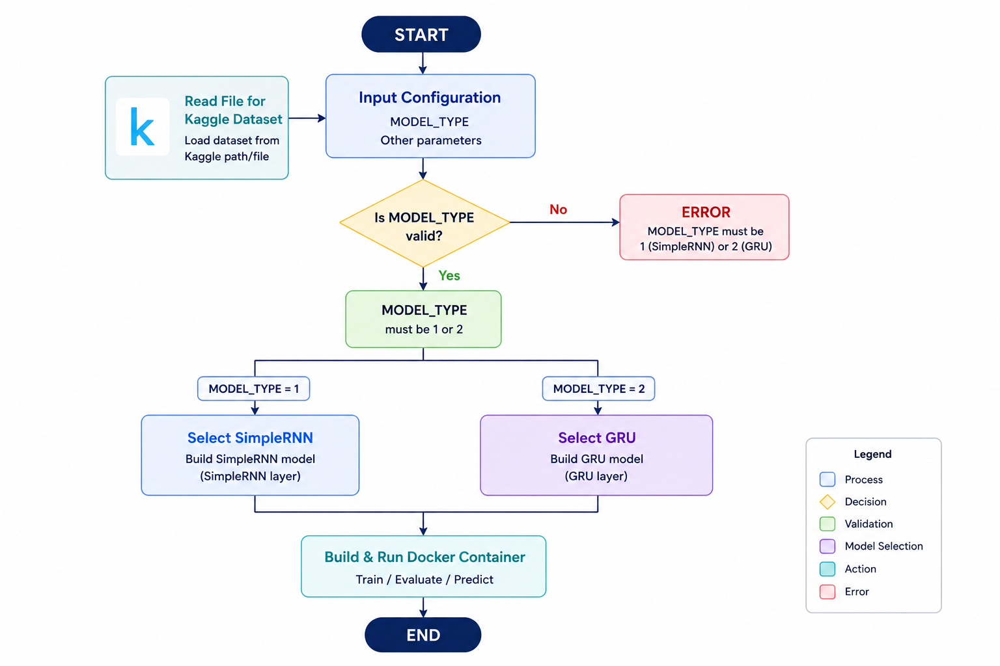

### Simple RNN & GRU model container base (Docker)
We need to merge the two files from phase one. Merge the SimpleRNN and GRU for each Dataset (Kaggle & Twitter Financial news)
<center></center>
<b>1-Kaggle for SimpleRNN and GRU</b>



<a href="birnn_bigru_kaggle_CIND860.py">birnn_bigru_kaggle_CIND860.py</a>

<b>2-Twitter financial news for SimpleRNN and GRU</b>


<a href="birnn_bigru_twitter_financial_CIND860.py">birnn_bigru_twitter_financial_CIND860.py</a>

## Prepare the file for building images

We need to build the image through building Dockerfile

<b>1- Dockerfile for Kaggle (SimpleRNN and GRU)</b> 

Dataset: Kaggle (file:all-data.csv)

Each image has:

<b>MODEL_TYPE</b>

MODEL_TYPE = 1  ->  Bidirectional SimpleRNN

MODEL_TYPE = 2  ->  Bidirectional GRU

<b>Input</b>

Input paramter: bitsimplernn-worker-(1|2|3 ...).env

This is to keep the setting configuration for the cluster

<b>Output</b>

-Input volume point to input folder

-output volume point to output folder

File requirements for Dockerfile.kaggle

- <a href="requirements.kaggle.txt">requirements.kaggle.txt</a>
- <a href="birnn_bigru_kaggle_multiworker.py">birnn_bigru_kaggle_multiworker.py</a>


```
FROM python:3.11-slim

WORKDIR /app

RUN apt-get update && apt-get install -y --no-install-recommends \
        build-essential \
        git \
        curl \
    && rm -rf /var/lib/apt/lists/*

COPY requirements.kaggle requirements.txt
RUN pip install --no-cache-dir --upgrade pip && \
    pip install --no-cache-dir -r requirements.txt

COPY birnn_bigru_kaggle_multiworker.py .

VOLUME ["/data/input", "/data/output"]
EXPOSE 12345

# --model-type, --input, --output, --start-delay are passed at `docker run` time
ENTRYPOINT ["python", "birnn_bigru_kaggle_multiworker.py"]
```
<a href="Dockerfile.kaggle">Dockerfile.kaggle</a>

<b>2- Dockerfile for Twitter financial news (SimpleRNN and GRU)</b> 

Dataset: Twitter (from Hugging face: zeroshot/twitter-financial-news-sentiment)

Each image has:

<b>MODEL_TYPE</b>

MODEL_TYPE = 1  ->  Bidirectional SimpleRNN

MODEL_TYPE = 2  ->  Bidirectional GRU

<b>Input</b>

Input paramter: bitsimplernn-worker-(1|2|3 ...).env

This is to keep the setting configuration for the cluster

<b>Output</b>

-Input volume point to input folder

-output volume point to output folder

```
FROM python:3.11-slim

WORKDIR /app

RUN apt-get update && apt-get install -y --no-install-recommends \
        build-essential \
        git \
        curl \
    && rm -rf /var/lib/apt/lists/*

COPY requirements.kaggle requirements.txt
RUN pip install --no-cache-dir --upgrade pip && \
    pip install --no-cache-dir -r requirements.txt

COPY birnn_bigru_kaggle_multiworker.py .

VOLUME ["/data/input", "/data/output"]
EXPOSE 12345

# --model-type, --input, --output, --start-delay are passed at `docker run` time
ENTRYPOINT ["python", "birnn_bigru_kaggle_multiworker.py"]
```

<a href="Dockerfile.twitter">Dockerfile.twitter</a>

## Build the image with Docker file

<b>Build Docker container image for Kaggle</b>

```
docker build -f Dockerfile.kaggle -t birnngru-kaggle:latest .
```

<b>Build Docker container image for Twitter</b>

```
docker build -f Dockerfile.twitter -t birnngru-twitter:latest .
```

## Display the images in the local docker

```
docker images
```


## Run in the local docker for twitter-financial-news-sentiment 

We run the docker commands at Powershell. We need to run with three workers (worker-0, worker-1 and worker-2). the worker-0 is chief-worker. The chief-worker is the master of worker. I responsible for filtering and prepare data. After to train the model, the three workers will train models.  

```
docker run -d --name bitsimplernn-worker-0 --hostname bitsimplernn-worker-0 `
  --network tf_net --expose 12345 --env-file bitsimplernn-worker-0.env `
  -v "//c/alaa/github/SimpleRNNGRU/docker/data/input:/data/input:ro" `
  -v "//c/alaa/github/SimpleRNNGRU/docker/data/output/worker-0:/data/output" `
  birnngru-twitter:latest --input /data/input --output /data/output --model-type 1

docker run -d --name bitsimplernn-worker-1 --hostname bitsimplernn-worker-1 `
  --network tf_net --expose 12345 --env-file bitsimplernn-worker-1.env `
  -v "//c/alaa/github/SimpleRNNGRU/docker/data/input:/data/input:ro" `
  -v "//c/alaa/github/SimpleRNNGRU/docker/data/output/worker-1:/data/output" `
  birnngru-twitter:latest --input /data/input --output /data/output --model-type 1 --start-delay 10

docker run -d --name bitsimplernn-worker-2 --hostname bitsimplernn-worker-2 `
  --network tf_net --expose 12345 --env-file bitsimplernn-worker-2.env `
  -v "//c/alaa/github/SimpleRNNGRU/docker/data/input:/data/input:ro" `
  -v "//c/alaa/github/SimpleRNNGRU/docker/data/output/worker-2:/data/output" `
  birnngru-twitter:latest --input /data/input --output /data/output --model-type 1 --start-delay 15
```


