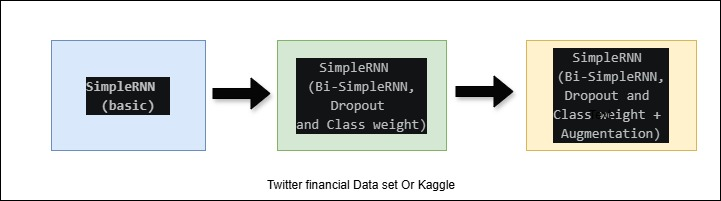
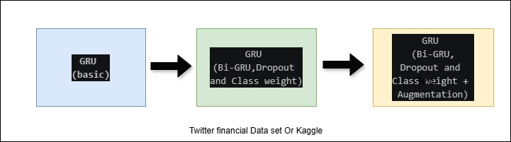

# Project plan

<b>Data analyses</b> We have two Datasets in this project:

<b>Data set: </b>

(i): Twitter Financial News Sentiment Analysis from Haggingface (zeroshot/twitter-financial-news-sentiment)

(ii): Kaggle Sentiment Analysis for Financial News Dataset


<b>Pipleine processing steps: </B>

<b>Part one:</b>

(i)  The data from zeroshot/twitter-financial-news-sentiment

(ii) Build the train_texts and test_texts from text and label columns

(ii) We use the method of TextVectorization (Tensorflow.keras.layers.TextVectorization)

     TextVectorization is the layer that turns raw sentences into the numbers a neural network can actually work with. Let's go through it argument by argument.

<b>Part two:</b> 

We tried to improve the processing:

(i) Solve the issue of imbalanced (e.g. neutral=60%, negative=11%). Without weighting, the model ignores rare classes to maximise accuracy. Compute_class_weight("balanced") assigns weights inversely proportional to frequency, so a mistake on a rare class costs proportionally more: 

(ii) Add augmenters (swap synonyms, delete random words, swap word positions and inject typos)

<b> Improved selected models SimpleRNN and GRU)</b>

(i) Build the model (SimpleRNN and GRU). We use 

(ii) We use the Bidirectional for the both models to improve the accuracy for the two models SimpleRNN and GRU

<b>Algorithms evaluation:</b>

We have two sets of CLASSIFICATION REPORT (SimpleRNN & GRU). In the report for classes we explain precision,recall,f1-score and support.
Aso we have report for accuracy, macro avg and weighted avg


# SimpleRNN and GRU

The plan is to implement SimpleRNN and GRU in two streams

<b>First stream</b>: we implement simpleRNN with Twitter finance dataset and Kaggle dataset



<b>Second stream</b>: we implement GRU with Twitter finance dataset and Kaggle dataset



## Twitter Financial News (Hagging face) 

The dataset contains finance-related tweets and news-style short texts labeled by sentiment.

Dataset size: ~12,000 financial tweets/text samples

Label: 0 = bearish 1 = bullish 2 = neutral

Refrence: https://huggingface.co/datasets/zeroshot/twitter-financial-news-sentiment?utm_source=chatgpt.com

<span style="color:red"><b>1. SimpleRNN Twitter financial (basic)</b></span>

<a href="simplernn/simplernn_twitter_financial_CIND860.py">simplernn_twitter_financial_CIND860.py</a>

<b>Result:</b>

```
────────────────────────────────────────────────────
CLASSIFICATION REPORT  (SimpleRNN)
────────────────────────────────────────────────────
              precision    recall  f1-score   support

     bearish       0.37      0.13      0.19       347
     bullish       0.45      0.43      0.44       475
     neutral       0.79      0.91      0.85      1566

    accuracy                           0.70      2388
   macro avg       0.54      0.49      0.49      2388
weighted avg       0.66      0.70      0.67      2388
```

```
Training Set Distribution
Bearish: 1442
Bullish : 1923
Neutral: 6178

Test Set Distribution
Bearish: 347
Bullish : 475
Neutral: 1566
```

<span style="color:red"><b>2. SimpleRNN Twitter financial (Bi-SimpleRNN,Dropout and Class weight)</b></span>
#### Improved Sentiment Analysis For Financial News (Twitter)

1- Adding Bidirectional: It's more expressive but it runs the sequence forward and backward, then concatenates both outputs, doubling the context the model sees for each word.

2- Adding Dropout: Overfitting is a major issue on small financial sentiment datasets

3- Add Class weight when we have unbalance result for the class. calculates weights inversely proportional to frequency

<a href="simpleRNN/bisimplernn_twitter_financial_CIND860.py">bisimplernn_twitter_financial_CIND860.py</a>


<b>Result:</b>

```
────────────────────────────────────────────────────
CLASSIFICATION REPORT  (BiSimpleRNN)
────────────────────────────────────────────────────
              precision    recall  f1-score   support

     bearish       0.58      0.50      0.54       347
     bullish       0.67      0.62      0.64       475
     neutral       0.84      0.89      0.86      1566

    accuracy                           0.78      2388
   macro avg       0.70      0.67      0.68      2388
weighted avg       0.77      0.78      0.77      2388
```

```
Class weights: bearish=2.21, bullsh=1.65, neutral=0.51
```

<span style="color:red"><b>3. SimpleRNN Twitter financial (Bi-SimpleRNN,Dropout and Class weight + Augmentation)</b></span>

<a href="simpleRNN/bisimplernn_twitter_financial_nlpaug_CIND860.py">bisimplernn_twitter_financial_nlpaug_CIND860.py</a>

```
────────────────────────────────────────────────────
CLASSIFICATION REPORT  (BiSimpleRNN + nlpaug)
────────────────────────────────────────────────────
              precision    recall  f1-score   support

     bearish       0.54      0.52      0.53       347
     bullish       0.63      0.63      0.63       475
     neutral       0.85      0.85      0.85      1566

    accuracy                           0.76      2388
   macro avg       0.67      0.67      0.67      2388
weighted avg       0.76      0.76      0.76      2388
```

## Sentiment Analysis For Financial News (kaggle)

The Dataset contains Financial PhraseBank dataset created by Malo et al. and contains financial news headlines labeled according to how a retail investor would perceive their impact on the market.

Label: 0 = Positive 1 = Negative 2 = Neutral

Refernce: https://www.kaggle.com/datasets/ankurzing/sentiment-analysis-for-financial-news 

<span style="color:red"><b>4. SimpleRNN Kaggle financial (Basic)</b></span>

<a href="simpleRNN/simplernn_kaggle_CIND860.py">simplernn_kaggle_CIND860.py</a>

<b>Result:</b>

```
────────────────────────────────────────────────────
CLASSIFICATION REPORT SimpleRNN
────────────────────────────────────────────────────
              precision    recall  f1-score   support

    negative       0.45      0.45      0.45       105
     neutral       0.75      0.78      0.77       585
    positive       0.52      0.49      0.51       280

    accuracy                           0.66       970
   macro avg       0.58      0.57      0.57       970
weighted avg       0.65      0.66      0.66       970
```

```
Training Set Distribution
Negative: 499
Neutral : 2294
Positive: 1083

Test Set Distribution
Negative: 105
Neutral : 585
Positive: 280
```

<span style="color:red"><b>5. SimpleRNN Kaggle financial (Bi-SimpleRNN,Dropout and Class weight)</b></span>

## Improved Sentiment Analysis For Financial News (kaggle)

1- Adding Bidirectional: It's more expressive but it runs the sequence forward and backward, then concatenates both outputs, doubling the context the model sees for each word.

2- Adding Dropout: Overfitting is a major issue on small financial sentiment datasets

3- Add Class weight when we have unbalance result for the class. calculates weights inversely proportional to frequency

<a href="simpleRNN/bisimpleRNN_kaggle_improved_CIN860.py">bisimpleRNN_kaggle_improved_CIN860.py</a>

<b>Result:</b>

```
────────────────────────────────────────────────────
CLASSIFICATION REPORT  (BiRNN)
────────────────────────────────────────────────────
              precision    recall  f1-score   support

    negative       0.49      0.61      0.54       105
     neutral       0.78      0.85      0.81       585
    positive       0.68      0.50      0.58       280

    accuracy                           0.72       970
   macro avg       0.65      0.65      0.64       970
weighted avg       0.72      0.72      0.71       970
```

```
Class weights:
  negative = 2.59
  neutral  = 0.56
  positive = 1.19
```
<span style="color:red"><b>6. SimpleRNN Kaggle financial (Bi-SimpleRNN,Dropout and Class weight + Augmentation)</b></span>

<a href="simpleRNN/bisimplernn_kaggle_nlpaug_CIND860.py">bisimple_rnn_kaggle_nlpaug_CIND860.py</a>

<b>Result:</b>

```
────────────────────────────────────────────────────
CLASSIFICATION REPORT  (BiRNN + nlpaug)
────────────────────────────────────────────────────
              precision    recall  f1-score   support

    negative       0.51      0.54      0.53       105
     neutral       0.79      0.74      0.77       585
    positive       0.54      0.60      0.57       280

    accuracy                           0.68       970
   macro avg       0.62      0.63      0.62       970
weighted avg       0.69      0.68      0.68       970
```

### GRU

## Twitter Financial News (Hagging face) 

<span style="color:red"><b>1. GRU Twitter financial (basic)</b></span>

<a href="gru/gru_twitter_financial_CIND860.py">gru_twitter_financial_CIND860.py</a>

<b>Result:</b>

```
────────────────────────────────────────────────────
CLASSIFICATION REPORT  (GRU)
────────────────────────────────────────────────────
              precision    recall  f1-score   support

     bearish       0.00      0.00      0.00       347
     bullish       0.00      0.00      0.00       475
     neutral       0.66      1.00      0.79      1566

    accuracy                           0.66      2388
   macro avg       0.22      0.33      0.26      2388
weighted avg       0.43      0.66      0.52      2388
```

```
Training Set Distribution
Bearish: 1442
Bullish : 1923
Neutral: 6178

Test Set Distribution
Bearish: 347
Bullish : 475
Neutral: 1566
```
<span style="color:red"><b>2. GRU Twitter financial (Bi-GRU,Dropout and Class weight)</b></span>

## Improved Sentiment Analysis For Financial News (Twitter)

1- Adding Bidirectional: It's more expressive but it runs the sequence forward and backward, then concatenates both outputs, doubling the context the model sees for each word.

2- Adding Dropout: Overfitting is a major issue on small financial sentiment datasets

3- Add Class weight when we have unbalance result for the class. calculates weights inversely proportional to frequency

<a href="gru/bigru_twitter_financial_CIND860.py">bigru_twitter_financial_CIND860.py</a>

<b>Result:</b>

```
────────────────────────────────────────────────────
CLASSIFICATION REPORT  (BiGRU)
────────────────────────────────────────────────────
              precision    recall  f1-score   support

     bearish       0.59      0.60      0.60       347
     bullish       0.68      0.69      0.68       475
     neutral       0.87      0.86      0.86      1566

    accuracy                           0.79      2388
   macro avg       0.71      0.72      0.71      2388
weighted avg       0.79      0.79      0.79      2388
```

```
Class weights: Bearish=2.21, Bullish=1.65, Neutral=0.51
```

<span style="color:red"><b>3. GRU Twitter financial (Bi-GRU,Dropout and Class weight + Augmentation)</b></span>

<a href="gru/bigru_twitter_financial_nlpaug_CIND860.py">bigru_twitter_financial_nlpaug_CIND860.py</a>

<b>Result:</b>

```
────────────────────────────────────────────────────
CLASSIFICATION REPORT  (BiGRU)
────────────────────────────────────────────────────
              precision    recall  f1-score   support

     bearish       0.59      0.60      0.60       347
     bullish       0.68      0.69      0.68       475
     neutral       0.87      0.86      0.86      1566

    accuracy                           0.79      2388
   macro avg       0.71      0.72      0.71      2388
weighted avg       0.79      0.79      0.79      2388
```

```
Class weights: Bearish=2.21, Bullish=1.65, Neutral=0.51
```

<span style="color:red"><b>4. GRU Kaggle financial (basic)</b></span>
## Sentiment Analysis For Financial News (kaggle)

<a href="gru/gru_kaggle_CIND860.py">gru_kaggle_CIND860.py</a>

<b>Result:</b>

```
────────────────────────────────────────────────────
CLASSIFICATION REPORT  (GRU)
────────────────────────────────────────────────────
              precision    recall  f1-score   support

    negative       0.00      0.00      0.00       105
     neutral       0.83      0.85      0.84       585
    positive       0.52      0.68      0.59       280

    accuracy                           0.71       970
   macro avg       0.45      0.51      0.48       970
weighted avg       0.65      0.71      0.68       970

────────────────────────────────────────────────────
```

```
Training Set Distribution
Negative: 499
Neutral : 2294
Positive: 1083

Test Set Distribution
Negative: 105
Neutral : 585
Positive: 280
```

<span style="color:red"><b>5. GRU Kaggle financial (Bi-GRU,Dropout and Class weight)</b></span>

## Improved Sentiment Analysis For Financial News (Kaggle)

1- Adding Bidirectional: It's more expressive but it runs the sequence forward and backward, then concatenates both outputs, doubling the context the model sees for each word.

2- Adding Dropout: Overfitting is a major issue on small financial sentiment datasets

3- Add Class weight when we have unbalance result for the class. calculates weights inversely proportional to frequency

<a href="gru/bigru_kaggle_CIND860.py">bigru_kaggle_CIND860.py</a>

<b>Result:</b>

```
────────────────────────────────────────────────────
CLASSIFICATION REPORT  (BiGRU)
────────────────────────────────────────────────────
              precision    recall  f1-score   support

    negative       0.56      0.70      0.62       105
     neutral       0.81      0.80      0.81       585
    positive       0.65      0.61      0.63       280

    accuracy                           0.74       970
   macro avg       0.67      0.70      0.69       970
weighted avg       0.74      0.74      0.74       970

────────────────────────────────────────────────────
```

```
Class weights: negative=2.59, neutral=0.56, positive=1.19
```

<span style="color:red"><b>6. GRU Twitter financial (Bi-GRU,Dropout and Class weight + Augmentation)</b></span>

<a href="gru/bigru_kaggle_nplaug_CIND860.py">bigru_kaggle_nplaug_CIND860.py</a>

<b>Result:</b>

```
────────────────────────────────────────────────────
CLASSIFICATION REPORT  (BiGRU + nlpaug)
────────────────────────────────────────────────────
              precision    recall  f1-score   support

    negative       0.57      0.66      0.61       105
     neutral       0.83      0.77      0.80       585
    positive       0.61      0.66      0.64       280

    accuracy                           0.73       970
   macro avg       0.67      0.70      0.68       970
weighted avg       0.74      0.73      0.73       970

Class weights: negative=2.59, neutral=0.56, positive=1.19
```

## Analysis Result:

<b>Improve the accuracy:</b>

1- Adding Bidirectional: It's more expressive but it runs the sequence forward and backward, then concatenates both outputs, doubling the context the model sees for each word.

2- Adding Dropout: Overfitting is a major issue on small financial sentiment datasets

3- Add Class weight when we have unbalance result for the class. calculates weights inversely proportional to frequency

The dataset is imbalanced (e.g. neutral=60%, negative=11%).
Without weighting, the model ignores rare classes to maximise accuracy. 
Example:
negative appears 105 times out of 970 across 3 classes
weight_negative = 970 / (3 * 105) ≈ 3.08   ← rare, high penalty
weight_neutral  = 970 / (3 * 585) ≈ 0.55   ← common, low penalty
weight_positive = 970 / (3 * 280) ≈ 1.15   ← medium

<b>Augmentation:</b>

Augmentation steps:
1. SynonymAug — Vocabulary variation
"profits rose"  ->  "earnings rose"
2. RandomWordAug (delete) — Missing words
"profits rose sharply"  ->  "profits sharply"
3. RandomWordAug (swap) — Word order variation
"profits rose sharply"  ->  "rose profits sharply"
4. KeyboardAug — Typo simulation
Example: "profits"  ->  "profkts"

<B>Conclusion:</b> 

Based on the results above, the improvement from GRU → BiGRU + class weights is clear, but adding NLP augmentation did not improve performance. This is actually a common finding in sentiment analysis, especially for financial text.
The experimental results show that the combination of Bidirectional GRU and class weighting significantly improved sentiment classification performance on both the Kaggle Financial News and Twitter Financial datasets.
NLP-based data augmentation did not provide further improvement.